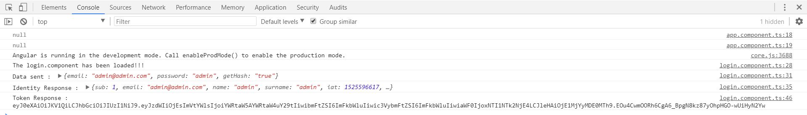

# Angular 5 - Task Manager (Frontend)

We will make the frontend of the application with the framework Angular and Bootstrap.

### Phases of the Demo
1. []()


---------------------------------------------------------------------------------------

* We will create the project through the console command: `ng new angular --style scss --routing`

---------------------------------------------------------------------------------------

### Summary Symfony component`s to use

* [Server Component](https://symfony.com/doc/current/setup.html), `composer require server --dev`
* 

### Summary Console command`s to be used

* `ng serve`
* `ng test`
* `ng generate module`
* `ng help generate component`
* `ng help generate component --dry-run`
* `ng g component mydir\dir2\UserProfile --dry-run`
* `ng g component UserProfile`
* `ng new app0 --style-scss --dry-run`

# Symfony 4 - Task Manager (Backend)

--------------------------------------------------------------------------------------------

### 1.Project Creation

--------------------------------------------------------------------------------------------

1. Created our project using the Console command's, 

```bash
ng new angular --style scss --routing
```

2. In the next step we will access the project folder using:

```bash
cd angular
```

3. It is necessary to install **npm** to run **angular project**:

```bash
npm install
```

4. Now, you will be able to view the result of demo when write in the terminal the command console `npm start` or `:

```bash
ng serve
```

5. Access to [http://localhost:4200/](http://localhost:4200/) to view the result.

6. We can also perform a **test** by launching the command `ng test`.

--------------------------------------------------------------------------------------------

### 2.Install Bootstrap

--------------------------------------------------------------------------------------------

(Source: [https://www.marathonus.com/about/blog/kickstarting-an-angular-5-project-with-bootstrap-4-sass-and-font-awesome/](https://www.marathonus.com/about/blog/kickstarting-an-angular-5-project-with-bootstrap-4-sass-and-font-awesome/))

1. To install Bootstrap in our Angular's project we will used the command `npm install bootstrap`.

```bash
npm install bootstrap
```

2. We will also install **Font-awesome**, **jquery** and **tether**.

```bash
npm install font-awesome jquery tether
```

3. We must configure [.angular-cli.json](.angular-cli.json) to use bootstrap.

```diff
//...
  "apps": [
    {
      "root": "src",
      "outDir": "dist",
      "assets": [
        "assets",
        "favicon.ico"
      ],
      "index": "index.html",
      "main": "main.ts",
      "polyfills": "polyfills.ts",
      "test": "test.ts",
      "tsconfig": "tsconfig.app.json",
      "testTsconfig": "tsconfig.spec.json",
      "prefix": "app",
      "styles": [
--      "styles.scss"
++      "styles.scss",
++      "../node_modules/bootstrap/scss/bootstrap.scss",
++      "../node_modules/font-awesome/scss/font-awesome.scss"
      ],
--    "scripts": [],
++    "scripts": [  
++      "../node_modules/jquery/dist/jquery.js",
++      "../node_modules/tether/dist/js/tether.js",
++      "../node_modules/bootstrap/dist/js/bootstrap.js"
++    ],
      "environmentSource": "environments/environment.ts",
      "environments": {
        "dev": "environments/environment.ts",
        "prod": "environments/environment.prod.ts"
      }      
//...
```

> Another option is to import the library within [src/styles.scss](./src/styles.scss).

_[src/styles.scss](./src/styles.scss)_
```diff
/* You can add global styles to this file, and also import other style files */
++ @import "../node_modules/bootstrap/scss/bootstrap";
++ $fa-font-path: "~font-awesome/fonts";
++ @import "~font-awesome/scss/font-awesome";
```

4. Now, you will be able to view the result of demo when write in the terminal the command console `npm start` or `:

```bash
ng serve
```

5. Access to [http://localhost:4200/](http://localhost:4200/) to view the result.

6. We can also perform a **test** by launching the command `ng test`.

--------------------------------------------------------------------------------------------

### 3.Install Angular Material and Angular Animations

--------------------------------------------------------------------------------------------

(Source: [https://material.angular.io/guide/getting-started](https://material.angular.io/guide/getting-started))

1. To install Bootstrap in our Angular's project we will used the command `npm install --save @angular/material @angular/cdk `.

```bash
npm install --save @angular/material @angular/cdk 
```

> Some Material components depend on the Angular animations module in order to be able to do more advanced transitions. If you want these animations to work in your app, you have to install the `@angular/animations` module and include the `BrowserAnimationsModule` in your app.

```bash
npm install --save @angular/animations
```

2. Now, you will be able to view the result of demo when write in the terminal the command console `npm start` or `:

```bash
ng serve
```

3. Access to [http://localhost:4200/](http://localhost:4200/) to view the result.

4. We can also perform a **test** by launching the command `ng test`.

--------------------------------------------------------------------------------------------

### 4.First Steps

--------------------------------------------------------------------------------------------

1. We will cleaned the **app.module** template [/src/app/app.component.html](./src/app/app.component.html)

_[/src/app/app.component.html](./src/app/app.component.html)_
```diff
<!--The content below is only a placeholder and can be replaced.-->
-- <div style="text-align:center">
   <h1>Welcome to {{ title }}!</h1>
--  
-- </div>
-- <h2>Here are some links to help you start: </h2>
-- <ul>
--  <li>
--    <h2><a target="_blank" rel="noopener" href="https://angular.io/tutorial">Tour of Heroes</a></h2>
--  </li>
--  <li>
--    <h2><a target="_blank" rel="noopener" href="https://github.com/angular/angular-cli/wiki">CLI Documentation</a></h2>
--  </li>
--  <li>
--    <h2><a target="_blank" rel="noopener" href="https://blog.angular.io/">Angular blog</a></h2>
--  </li>
-- </ul>
-- <router-outlet></router-outlet>
```

2. In this project we will need to use the **angular form and http components**, for this we import them into [/src/app/app.module.ts](./src/app/app.module.ts).

_[/src/app/app.module.ts](./src/app/app.module.ts)_
```diff
import { BrowserModule } from '@angular/platform-browser';
import { NgModule } from '@angular/core';
++ import { FormsModule } from '@angular/forms';
++ import { HttpModule } from '@angular/http';

import { AppRoutingModule } from './app-routing.module';

import { AppComponent } from './app.component';

@NgModule({
  declarations: [
    AppComponent,
  ],
  imports: [
    BrowserModule,
--  AppRoutingModule
++  AppRoutingModule,
++  FormsModule,
++  HttpModule
  ],
  providers: [],
  bootstrap: [AppComponent]
})
export class AppModule { }
```

> Our project will be structured in `components`, `models`, `views` and `test`, so we must create a folder for each type of element within the [src/](./src/) folder.

´´´bash
/src/
 |- /app/
      |- /components/
      |- /models/
      |- /pipes/
      |- /services/
      |- /test/
      |- /views/
´´´

3. We will generated our first component using the command `ng generate component login --style scss`.

```bash
  create src/app/login/login.component.html (24 bytes)
  create src/app/login/login.component.spec.ts (621 bytes)
  create src/app/login/login.component.ts (266 bytes)
  create src/app/login/login.component.scss (0 bytes)
  update src/app/app.module.ts (596 bytes)
```

> This command will have generated a folder with the content of the new component within the app called login. As we mentioned before, we will have to redistribute that content and reference it in the different files to follow the logical structure of the previously defined project.

* [/src/app/login/login.component.html](./src/app/login/login.component.html) ->
[/src/app/views/login.component.html](./src/app/views/login.component.html).
* [/src/app/login/login.component.ts](./src/app/login/login.component.ts) ->
[/src/app/components/login.component.ts](./src/app/components/login.component.ts).
* [/src/app/login/login.component.scss](./src/app/login/login.component.scss) -> it's erased.
* [/src/app/login/login.component.spec.ts](./src/app/login/login.component.spec.ts) -> it's erased.

4. We update [/src/app/app.module.ts](./src/app/app.module.ts) with the new component locations.

_[/src/app/app.module.ts](./src/app/app.module.ts)_
```diff
import { BrowserModule } from '@angular/platform-browser';
import { NgModule } from '@angular/core';
import { FormsModule } from '@angular/forms';
import { HttpModule } from '@angular/http';

import { AppRoutingModule } from './app-routing.module';

import { AppComponent } from './app.component';

-- import { LoginComponent } from './login/login.component';
++ import { LoginComponent } from './components/login.component';

@NgModule({
  declarations: [
    AppComponent,
    LoginComponent
  ],
  imports: [
    BrowserModule,
    AppRoutingModule,
    FormsModule,
    HttpModule
  ],
  providers: [],
  bootstrap: [AppComponent]
})
export class AppModule { }
```

> **Note:** Don't forget to declare the new component inside the decorator `@NgModule` in `declarations: [...]`.

5. In the next step we will modify [/src/app/components/login.component.ts](./src/app/components/login.component.ts). _We will also include the methods that will manage the routing (`import { Router, ActivatedRoute, Params, RouterEvent } from '@angular/router';`)._

_[/src/app/components/login.component.ts](./src/app/components/login.component.ts)_
```diff
import { Component, OnInit } from '@angular/core';

@Component({
  selector: 'app-login',
-- templateUrl: './login.component.html',
++ templateUrl: '../views/login.component.html' 
-- styleUrls: ['./login.component.scss']
})
export class LoginComponent implements OnInit {
++ public title: string;

-- constructor() { }
++ constructor(
++ ){
++  this.title = 'Login Component';
++ }

  ngOnInit() {
++ console.log('The login.component has been loaded!!!');    
  }

}
```

6. Now we can include the component within the module [/src/app/app.component.html](./src/app/app.component.html).

_[/src/app/app.component.html](./src/app/app.component.html)_
```diff
<!--The content below is only a placeholder and can be replaced.-->
<h1>Welcome to {{ title }}!</h1>
++ <app-login></app-login>
```

7. Now, you will be able to view the result of demo when write in the terminal the command console `npm start` or `:

```bash
ng serve
```

8. Access to [http://localhost:4200/](http://localhost:4200/) to view the result.


--------------------------------------------------------------------------------------------

### 5.Router

--------------------------------------------------------------------------------------------


1. To define a new route in our application, we will modify [/src/app/app-routing.module.ts](./src/app/app-routing.module.ts)

_[/src/app/app-routing.module.ts](./src/app/app-routing.module.ts)_
```diff
import { NgModule } from '@angular/core';
import { Routes, RouterModule } from '@angular/router';

++ import { LoginComponent } from './components/login.component';

-- const routes: Routes = [];
++ const routes: Routes = [
++   {path: '', component: LoginComponent},
++   {path: 'login', component: LoginComponent},
++   {path: '**', component: LoginComponent}
++ ];

@NgModule({
  imports: [RouterModule.forRoot(routes)],
  exports: [RouterModule]
})
export class AppRoutingModule { }
```

2. And we add the routing of **Angular** `import { RouterModule } from '@angular/router';` in [/src/app/app.module.ts](./src/app/app.module.ts).

_[/src/app/app.module.ts](./src/app/app.module.ts)_
```diff
import { BrowserModule } from '@angular/platform-browser';
import { NgModule } from '@angular/core';
import { FormsModule } from '@angular/forms';
import { HttpModule } from '@angular/http';

++ import { RouterModule } from '@angular/router';
import { AppRoutingModule } from './app-routing.module';

import { AppComponent } from './app.component';
import { LoginComponent } from './components/login.component';

@NgModule({
  declarations: [
    AppComponent,
    LoginComponent
  ],
  imports: [
    BrowserModule,
    AppRoutingModule,
    FormsModule,
    HttpModule
  ],
  providers: [],
  bootstrap: [AppComponent]
})
export class AppModule { }
```

3. Now, we modify [/src/app/app.component.html](./src/app/app.component.html) to add the component `<router-outlet></router-outlet>` that will show the component according to its route, [/src/app/app-routing.module.ts](./src/app/app-routing.module.ts).

_[/src/app/app.component.html](./src/app/app.component.html)_
```diff
<!--The content below is only a placeholder and can be replaced.-->
<h1>Welcome to {{ title }}!</h1>
-- <app-login></app-login>
++ <router-outlet></router-outlet>
```

9. Now, you will be able to view the result of demo when write in the terminal the command console `npm start` or `:

```bash
ng serve
```

10. Access to [http://localhost:4200/login](http://localhost:4200/login) to view the result.

--------------------------------------------------------------------------------------------

### 5.Navbar Menu

--------------------------------------------------------------------------------------------

1. We will create our **Navbar Menu** in [/src/app/app.component.html](./src/app/app.component.html).

_[/src/app/app.component.html](./src/app/app.component.html)_
```diff
++ <nav class="navbar navbar-expand-lg navbar-light bg-light" style="background-color: #e3f2fd;">
++   <a class="navbar-brand" [routerLink]="['/']">
++     
++   </a>
++   <button class="navbar-toggler" type="button" data-toggle="collapse" data-target="#navbarSupportedContent" aria-controls="navbarSupportedContent" aria-expanded="false" aria-label="Toggle navigation">
++     <span class="navbar-toggler-icon"></span>
++   </button>
++   <div class="collapse navbar-collapse" id="navbarSupportedContent">
++     <ul class="navbar-nav mr-auto">
++       <li class="nav-item active">
++         <a class="nav-link"[routerLink]="['/']"><i class="fa fa-home" aria-hidden="true"></i> Home</a>
++       </li>
++       <li class="nav-item">
++         <a class="nav-link" [routerLink]="['/task-new']"><i class="fa fa-plus" aria-hidden="true"></i> New Task</a>
++       </li>
++       <li class="nav-item">
++           <a class="nav-link" [routerLink]="['/user-edit']"><i class="fa fa-cog" aria-hidden="true"></i> Configuration</a>
++       </li>
++       <li class="nav-item">
++         <a class="nav-link" [routerLink]="['/login', 1]"><i class="fa fa-sign-out" aria-hidden="true"></i> Logout</a>
++       </li>
++     </ul>
++     <ul class="navbar-nav ml-auto">
++       <li class="nav-item">
++         <a class="nav-link" [routerLink]="['/login']"> Access</a>
++       </li>
++       <li class="nav-item">
++         <a class="nav-link" [routerLink]="['/register']"> Register</a>
++       </li>
++     </ul>
++   </div>
++ </nav>
++ <div class="container">
-- <!--The content below is only a placeholder and can be replaced.-->
-- <h1>Welcome to {{ title }}!</h1>
<router-outlet></router-outlet>
++ </div>
```

2. And Update our stylesheet [src/app/styles.scss](./src/app/styles.scss).

_[src/app/styles.scss](./src/app/styles.scss)_
```diff
/* You can add global styles to this file, and also import other style files */
#logo{
	height: 35px;
	margin-top: -10px;
}
#header {
  border: 0.5px solid grey;
}
```

> This menu will always appear within the web.

3. Now we can navigate through the different URLs

--------------------------------------------------------------------------------------------

### 6.Login Form

--------------------------------------------------------------------------------------------

1. We will created our first form, for the login in [src/app/views/login.component.html](./src/app/views/login.component.html).

_[src/app/views/login.component.html](./src/app/views/login.component.html)_
```diff
-- <p>login works!</p>
++ <div class="col-md-12">
++ <h3>{{title}}</h3>
++  <form #loginForm="ngForm" (ngSubmit)="onSubmit()" class="col-md-4 no-padding needs-validation">
++   <div class="form-group">
++    <label for="inputEmail">Email address</label>
++    <input type="email" class="form-control" aria-describedby="emailHelp" placeholder="Enter email">
++   </div>
++   <div class="form-group">
++    <label for="inputPassword">Password</label>
++    <input type="password" class="form-control" placeholder="Password">
++   </div>
++   <button type="submit" class="btn btn-primary">Submit</button>
++  </form>
++ </div>
```

2. And Update our stylesheet [src/app/styles.scss](./src/app/styles.scss).

_[src/app/styles.scss](./src/app/styles.scss)_
```diff
/* You can add global styles to this file, and also import other style files */
#logo{
	height: 35px;
	margin-top: -10px;
}
#header {
  border: 0.5px solid grey;
}
++ .no-padding{
++	padding-left: 0px;
++ }
```

3. To send and receive the form we will act on the file [src/app/components/login.component.ts](./src/app/components/login.component.ts).

_[src/app/components/login.component.ts](./src/app/components/login.component.ts)_
```diff
import { Component, OnInit } from '@angular/core';
import { Router, ActivatedRoute, Params, RouterEvent } from '@angular/router';

@Component({
  selector: 'app-login',
  templateUrl: '../views/login.component.html' 
})
export class LoginComponent implements OnInit {
  public title: string;
++ public user;

  constructor(
  ){
    this.title = 'Login Component';
++  this.user = {
++    "email": "",
++    "password":"",
++    "getHash": false  
++  }    
  }

  ngOnInit() {
    console.log('The login.component has been loaded!!!');    
  }

++ onSubmit(){
++  console.log(this.user);
++ }
}
```

> We have created a new property within the login component, `user`, that will manage the information sent in the form. Now we must link each element of the new user object within the form's view.

> We also add the `onSubmit(){}` function added in the header of the form and that will be activated when sending it.

4. Update [src/app/views/login.component.html](./src/app/views/login.component.html).

_[src/app/views/login.component.html](./src/app/views/login.component.html)_
```diff
<div class="col-md-12">
  <h3>{{title}}</h3>
  <form #loginForm="ngForm" (ngSubmit)="onSubmit()" class="col-md-4 no-padding needs-validation">
    <div class="form-group">
      <label for="inputEmail">Email address</label>
--    <input type="email" class="form-control" aria-describedby="emailHelp" placeholder="Enter email">
++    <input type="email" class="form-control" aria-describedby="emailHelp" placeholder="Enter email" name="email" #email="ngModel" [(ngModel)]="user.email" required>
++    <span *ngIf="!email.valid && email.touched">Invalid email</span>
    </div>
    <div class="form-group">
      <label for="inputPassword">Password</label>
--    <input type="password" class="form-control" placeholder="Password">
++    <input type="password" class="form-control" placeholder="Password" name="password" #password="ngModel" [(ngModel)]="user.password" required>
++    <span *ngIf="!password.valid && password.touched">Invalid email</span>
    </div>
--  <button type="submit" class="btn btn-primary">Submit</button>
++  <button type="submit" class="btn btn-primary" [disabled]="!loginForm.form.valid">Submit</button>
  </form>
</div>
```

> We use the **name of input** `name = "email"`, a name in addition to **reference it within the angular component** `#email="ngModel"` and the element `[(ngModel)]="user.email"`. The latter will be used as **Two-way Data Binding**, with this element the content is updated in both directions, that is, modifying the form will also modify the varlo of the variable within the component.

> We will add the `required` property within each input as these are necessary.

> We will also add a message within a conditional as a validator, `<span *ngIf="!email.valid && email.touched">Invalid email</span>`.

> We can also add the option to disable the send button when the form is not valid, `<button type="submit" class="btn btn-primary" [disabled]="!loginForm.form.valid">Submit</button>`.

5. To be able to work with the form it is necessary to create several new service.

> We will create a file that will save the global configuration of our application [src/app/services/gloal.ts](./src/app/services/gloal.ts).

_[src/app/services/global.ts](./src/app/services/global.ts)_
```ts
export let GLOBAL = {
  // Local
  url: 'http://127.0.0.1:8000'
  // Production
  // url: 'http://127.0.0.1:8000'
};
```

Other service will be.

_[src/app/services/user.service.ts](./src/app/services/user.service.ts)_
```ts
import {Injectable} from '@angular/core';
import {Http, Response, Headers} from '@angular/http';
import 'rxjs/add/operator/map';
import {Observable} from '../../../node_modules/rxjs/Observable';
import {GLOBAL} from './global';

@Injectable()
export class UserService{
  public url: string;

  constructor(private _http: Http){
    this.url = GLOBAL.url;
  }
  signup(){
    console.log('Service user started');
  }
}
```

6. And update [src/app/components/login.component.ts](./src/app/components/login.component.ts) with this new service.

_[src/app/components/login.component.ts](./src/app/components/login.component.ts)_
```diff
import { Component, OnInit } from '@angular/core';
import { Rouuserter, ActivatedRoute, Params, RouterEvent } from '@angular/router';
++ import { UserService } from '../services/user.service';

@Component({
  selector: 'app-login',
--  templateUrl: '../views/login.component.html'  
++  templateUrl: '../views/login.component.html',
++ providers: [UserService]
})
export class LoginComponent implements OnInit {
  public title: string;
  public user: user;
  constructor(
++  private _userService: UserService 
  ){
    this.title = 'Login Component';
    this.user = {
      "email": "",
      "password":"",
      "getHash": false  
    }    
  }
  ngOnInit() {
    console.log('The login.component has been loaded!!!');    
  }
  onSubmit(){
    console.log(this.user);
++  this._userService.signup();
  }    
}
```

7. Now, you will be able to view the result of demo when write in the terminal the command console `npm start` or `:

```bash
ng serve
```

8. Access to [http://localhost:4200/login](http://localhost:4200/login) and send our form.

> Next step will be to correctly send the form to interpret it and finally login.

> **IMPORTANT**: Surely when sending the form you have a Error “No 'Access-Control-Allow-Origin' header is present on the requested resource”, this happens when consuming a REST API service with the POST method in AngularJS. To fix it locally, install this [Allow-Control-Allow-Origin](https://chrome.google.com/webstore/detail/allow-control-allow-origi/nlfbmbojpeacfghkpbjhddihlkkiljbi) extension in chrome, activate it and allow connections between domains.

9. Update [src/app/services/user.service.ts](./src/app/services/user.service.ts), to can send and use the method `singup(){}`.

_[src/app/services/user.service.ts](./src/app/services/user.service.ts)_
```diff
import {Injectable} from '@angular/core';
import {Http, Response, Headers} from '@angular/http';
import 'rxjs/add/operator/map';
import {Observable} from '../../../node_modules/rxjs/Observable';
import {GLOBAL} from './global';

@Injectable()
export class UserService{
  public url: string;

  constructor(private _http: Http){
    this.url = GLOBAL.url;
  }
-- signup(){
++ signup(user_to_login){  
--   console.log('Service user started');
++   let json = JSON.stringify(user_to_login);
++   let params = "json="+json;
++   let headers = new Headers({'Content-Type':'application/x-www-form-urlencoded'});
++   return this._http.post(this.url+'/login', params, {headers: headers})
++     .map(res => res.json());
++ }
}
```

10. We will modify [src/app/components/login.component.ts](./src/app/components/login.component.ts) to send the form using the **submit** button. We will need to add two new variables to use the `onSubmit(){}` method, `identity` and `token`.

_[src/app/components/login.component.ts](./src/app/components/login.component.ts)_
```diff
import { Component, OnInit } from '@angular/core';
import { Rouuserter, ActivatedRoute, Params, RouterEvent } from '@angular/router';
import { UserService } from '../services/user.service';

@Component({
  selector: 'app-login',
  templateUrl: '../views/login.component.html',
  providers: [UserService]
})
export class LoginComponent implements OnInit {
  public title: string;
  public user;
++ public identity;
++ public token; 

  constructor(
    private _userService: UserService,
  ){
    this.title = 'Login Component';
    this.user = {
      "email": "",
      "password":"",
      "getHash": false
    }
  }
  ngOnInit() {
    console.log('The login.component has been loaded!!!');
++  console.log('Login-Component - Identity : ', JSON.parse(localStorage.getItem('identity')));
  }
  onSubmit(){
    console.log(this.user);
--  this._userService.signup();
++  this._userService.signup(this.user).subscribe(
++    response => {
++      this.identity = response;
++      console.log('Identity Response : ', response);
++      if (this.identity.length <= 1) {
++        console.log('Server error');
++      } else {
++        if (!this.identity.status) { 
++          localStorage.setItem('identity', JSON.stringify(this.identity)); 
++        }
++      }
++    },
++    error => { console.log(<any>error); }
++  );
  }
}
```

> Now if we access within the browser inspector to **network > XHR** we will see two answers with the data requested to the service.


11. We update login.component by adding the token option when sending the form.

_[src/app/components/login.component.ts](./src/app/components/login.component.ts)_
```diff
import { Component, OnInit } from '@angular/core';
import { Rouuserter, ActivatedRoute, Params, RouterEvent } from '@angular/router';
import { UserService } from '../services/user.service';

// ...

export class LoginComponent implements OnInit {
  // ...
  ngOnInit() {
    console.log('The login.component has been loaded!!!');
    console.log('Login-Component - Identity : ', JSON.parse(localStorage.getItem('identity')));
++  console.log('Login-Component - Token : ', JSON.parse(localStorage.getItem('token')));
  }  
  onSubmit(){
    console.log(this.user);
    this._userService.signup(this.user).subscribe(
      response => {
        this.identity = response;
        console.log('Identity Response : ', response);
        if (this.identity.length <= 1) {
          console.log('Server error');
        } else {
          if (!this.identity.status) { 
            localStorage.setItem('identity', JSON.stringify(this.identity)); 
++          // GET TOKEN
++          this.user.getHash = null;
++          this._userService.signup(this.user).subscribe(
++            response => {
++              this.token = response;
++              console.log('Token Response : ', response);
++              if(this.identity.length <= 1){
++                console.log('Server Error');
++              } else {
++                if(!this.identity.status){ 
++                  localStorage.setItem('token', JSON.stringify(this.token)); 
++                  window.location.href = "/"; 
++                }
++              }
++            },
++            error => { console.log(<any>error); }
++          );
          }
        }
      },
      error => {
        console.log(<any>error);
      }
    );
  }
}
```

12. And update the template of the component, [src/app/views/login.component.html](./src/app/views/login.component.html), to indicate that the login was correct or not.

_[src/app/views/login.component.html](./src/app/views/login.component.html)_
```diff
<div class="col-md-12">
  <h3>{{title}}</h3>
++ <div class="indentity-alert alert alert-success" *ngIf="identity && identity.sub">
++   You have identified correctly! Wellcome {{identity.email}}
++ </div>
++ <div class="indentity-alert alert alert-danger" *ngIf="identity && identity.data">
++   You have not identified correctly! 
++ </div>   
  <form #loginForm="ngForm" (ngSubmit)="onSubmit()" class="col-md-4 no-padding needs-validation">
    <div class="form-group">
      <label for="inputEmail">Email address</label>
      <input type="email" class="form-control" aria-describedby="emailHelp" placeholder="Enter email" name="email" #email="ngModel" [(ngModel)]="user.email" required>
      <span *ngIf="!email.valid && email.touched">Invalid email</span>
    </div>
    <div class="form-group">
      <label for="inputPassword">Password</label>
      <input type="password" class="form-control" placeholder="Password" name="password" #password="ngModel" [(ngModel)]="user.password" required>
      <span *ngIf="!password.valid && password.touched">Invalid email</span>
    </div>
    <button type="submit" class="btn btn-primary" [disabled]="!loginForm.form.valid">Submit</button>
  </form>
</div>
```

13. Finally we will generate the default component, that will perform the home function, using the command `ng generate component default --style scss`

```bash
  create src/app/default/default.component.html (26 bytes)
  create src/app/default/default.component.spec.ts (635 bytes)
  create src/app/default/default.component.ts (274 bytes)
  create src/app/default/default.component.scss (0 bytes)
  update src/app/app.module.ts (857 bytes)
```

> This command will have generated a folder with the content of the new component within the app called **default**. As we mentioned before, we will have to redistribute that content and reference it in the different files to follow the logical structure of the previously defined project.

* [/src/app/default/default.component.html](./src/app/default/default.component.html) ->
[/src/app/views/default.component.html](./src/app/views/default.component.html).
* [/src/app/default/default.component.ts](./src/app/default/default.component.ts) ->
[/src/app/components/default.component.ts](./src/app/components/default.component.ts).
* [/src/app/default/default.component.scss](./src/app/default/default.component.scss) -> it's erased.
* [/src/app/default/default.component.spec.ts](./src/app/default/default.component.spec.ts) -> it's erased.

14. We update [/src/app/app.module.ts](./src/app/app.module.ts) with the new component locations.

_[/src/app/app.module.ts](./src/app/app.module.ts)_
```diff
import { BrowserModule } from '@angular/platform-browser';
import { NgModule } from '@angular/core';
import { FormsModule } from '@angular/forms';
import { HttpModule } from '@angular/http';

import { AppRoutingModule } from './app-routing.module';

import { AppComponent } from './app.component';

import { LoginComponent } from './components/login.component';
-- import { DefaultComponent } from './default/default.component';
++ import { DefaultComponent } from './components/default.component';

@NgModule({
  declarations: [
    AppComponent,
--  LoginComponent
++  LoginComponent,
++  DefaultComponent
  ],
  imports: [
    BrowserModule,
    AppRoutingModule,
    FormsModule,
    HttpModule
  ],
  providers: [],
  bootstrap: [AppComponent]
})
export class AppModule { }
```

> **Note:** Don't forget to declare the new component inside the decorator `@NgModule` in `declarations: [...]`.

15. In the next step we will modify [/src/app/components/default.component.ts](./src/app/components/default.component.ts). _We will also include the methods that will manage the routing (`import { Router, ActivatedRoute, Params, RouterEvent } from '@angular/router';`)._

_[/src/app/components/default.component.ts](./src/app/components/default.component.ts)_
```diff
import { Component, OnInit } from '@angular/core';

@Component({
  selector: 'app-default',
-- templateUrl: './default.component.html',
++ templateUrl: '../views/default.component.html' 
-- styleUrls: ['./default.component.scss']
})
export class DefaultComponent implements OnInit {
++ public title: string;

-- constructor() { }
++ constructor(
++ ){
++  this.title = 'Default Component';
++ }

  ngOnInit() {
++ console.log('The default.component has been loaded!!!');    
  }

}
```

16. And we will updated [src/app/app-routing.module.ts](./src/app/app-routing.module.ts).

_[src/app/app-routing.module.ts](./src/app/app-routing.module.ts)_
```diff
import { NgModule } from '@angular/core';
import { Routes, RouterModule } from '@angular/router';

import { LoginComponent } from './components/login.component';
-- import { DefaultComponent } from './default/default.component';
++ import { DefaultComponent } from './components/default.component';

const routes: Routes = [
-- { path: '', component: LoginComponent },
++ { path: '', component: DefaultComponent },
  { path: 'login', component: LoginComponent },
  { path: 'logout', component: LoginComponent },
  { path: '**', component: LoginComponent },
];

@NgModule({
  imports: [RouterModule.forRoot(routes)],
  exports: [RouterModule]
})
export class AppRoutingModule { }
```

--------------------------------------------------------------------------------------------

### 7.Auxiliary Login Methods

--------------------------------------------------------------------------------------------

> We will generate a series of auxiliary methods that will allow us to extract information from the user entity. These methods extract information from the `localstorage`

1. We will update [src/app/services/user.service.ts](./src/app/services/user.service.ts) with those new auxiliary methods.

_[src/app/services/user.service.ts](./src/app/services/user.service.ts)_
```diff
import { Injectable } from '@angular/core';
import { Http, Response, Headers } from '@angular/http';
import 'rxjs/add/operator/map';
import { Observable } from '../../../node_modules/rxjs/Observable';
import { GLOBAL } from './global';

@Injectable()
export class UserService {
  public url: string;
++ public identity;
++ public token;

  constructor(private _http: Http) {
    this.url = GLOBAL.url;
  }
  signup(user_to_login) {
    console.log('Service user started');
    let json = JSON.stringify(user_to_login);
    let params = "json=" + json;
    let headers = new Headers({ 'Content-Type': 'application/x-www-form-urlencoded' });
    return this._http.post(this.url + '/login', params, { headers: headers })
      .map(res => res.json());
  }
++ getIdentity() {
++   let identity = JSON.parse(localStorage.getItem('identity'));
++   this.identity = (identity != "undefined") ? identity : null;
++   return this.identity;
++ }

++ getToken() {
++   let token = JSON.parse(localStorage.getItem('token'));
++   this.token = (token != "undefined") ? token : null;
++   return this.token;
++ }  
}
```

2. We tested these auxiliary methods in [src/app/views/login.component.ts](./src/app/views/login.component.ts).

_[src/app/components/login.component.ts](./src/app/components/login.component.ts)_
```diff
import { Component, OnInit } from '@angular/core';
import { Rouuserter, ActivatedRoute, Params, RouterEvent } from '@angular/router';
import { UserService } from '../services/user.service';

// ...

export class LoginComponent implements OnInit {
  // ...
  ngOnInit() {
    console.log('The login.component has been loaded!!!');
--  console.log('Login-Component - Identity : ', JSON.parse(localStorage.getItem('identity')));
++  console.log(this._userService.getIdentity());    
--  console.log('Login-Component - Token : ', JSON.parse(localStorage.getItem('token')));
++  console.log(this._userService.getToken()); 
  }
  // ...
}
```

3. The next step will be to take from the [src/app/views/login.component.ts](./src/app/views/login.component.ts) component to the module [src/app/app.component.html](./src/app/views/app.component.html) the `ngOnInit(){}` functions that show the login data to verify its correct functioning.


_[src/app/components/login.component.ts](./src/app/components/login.component.ts)_
```diff
import { Component, OnInit } from '@angular/core';
import { Rouuserter, ActivatedRoute, Params, RouterEvent } from '@angular/router';
import { UserService } from '../services/user.service';

// ...

export class LoginComponent implements OnInit {
  // ...
  ngOnInit() {
    console.log('The login.component has been loaded!!!');
--  console.log(this._userService.getIdentity());    
--  console.log(this._userService.getToken()); 
  }
  // ...
}
```

_[src/app/app.component.ts](./src/app/app.component.ts)_
```diff
-- import { Component } from '@angular/core';
++ import { Component, OnInit } from '@angular/core';
++ import { UserService } from './services/user.service';

@Component({
  selector: 'app-root',
  templateUrl: './app.component.html',
-- styleUrls: ['./app.component.scss']
++ styleUrls: ['./app.component.scss'],
++ providers:[UserService]
})
export class AppComponent {
  title = 'app';

++ constructor (
++  private _userService: UserService  
++ ){}

++ ngOnInit(){
++  console.log(this._userService.getIdentity());    
++  console.log(this._userService.getToken());
++ }
```

4. Now, you will be able to view the result of demo when write in the terminal the command console `npm start` or `:

```bash
ng serve
```

5. Access to [http://localhost:4200/login](http://localhost:4200/login) and send our form.

> Next step will be to correctly send the form to interpret it and finally login.

> **IMPORTANT**: Surely when sending the form you have a Error “No 'Access-Control-Allow-Origin' header is present on the requested resource”, this happens when consuming a REST API service with the POST method in AngularJS. To fix it locally, install this [Allow-Control-Allow-Origin](https://chrome.google.com/webstore/detail/allow-control-allow-origi/nlfbmbojpeacfghkpbjhddihlkkiljbi) extension in chrome, activate it and allow connections between domains.

> Now if we access within the browser inspector to **Console** we will see two answers with the data requested to the service.



> We are already logged in, so if we move through the different urls of our application we can see the data of our user.

--------------------------------------------------------------------------------------------

### 8.Authentication Throughout the App

--------------------------------------------------------------------------------------------

1. Then, we will take the login system to [src/app/app.component.ts](./src/app/app.component.ts).

_[src/app/app.component.ts](./src/app/app.component.ts)_
```diff
import { Component, OnInit } from '@angular/core';
import { UserService } from './services/user.service';

@Component({
  selector: 'app-root',
  templateUrl: './app.component.html',
  styleUrls: ['./app.component.scss'],
  providers:[UserService]
})
export class AppComponent {
-- title = 'app';
++ public title = 'app';
++ public identity;
++ public token;

  constructor (
    private _userService: UserService  
--  ){}
++  ){
++    this.identity = this._userService.getIdentity();
++    this.identity = this._userService.getToken();
++  }

  ngOnInit(){
--  console.log(this._userService.getIdentity());
--  console.log(this._userService.getToken());
++  console.log('app.component loaded!!');
  }
```

--------------------------------------------------------------------------------------------

### 9.Variations of NavBar Menu

--------------------------------------------------------------------------------------------

1. The menu will change according to our authentication status (logged, not logged).

_[/src/app/app.component.html](./src/app/app.component.html)_
```diff
<nav class="navbar navbar-expand-lg navbar-light bg-light" style="background-color: #e3f2fd;">
  <a class="navbar-brand" [routerLink]="['/']">
    
  </a>
  <button class="navbar-toggler" type="button" data-toggle="collapse" data-target="#navbarSupportedContent" aria-controls="navbarSupportedContent" aria-expanded="false" aria-label="Toggle navigation">
    <span class="navbar-toggler-icon"></span>
  </button>
  <div class="collapse navbar-collapse" id="navbarSupportedContent">
    <ul class="navbar-nav mr-auto">
      <li class="nav-item active">
        <a class="nav-link"[routerLink]="['/']"><i class="fa fa-home" aria-hidden="true"></i> Home</a>
      </li>
      <li class="nav-item">
--      <a class="nav-link" [routerLink]="['/task-new']"><i class="fa fa-plus" aria-hidden="true"></i> New Task</a>   
++      <a class="nav-link" [routerLink]="['/task-new']" *ngIf="identity && identity.sub">
++        <i class="fa fa-plus" aria-hidden="true"></i> 
++        New Task
++      </a>
      </li>
++  </ul>      
++  <ul class="navbar-nav ml-auto" *ngIf="identity && identity.sub">
      <li class="nav-item">
        <a class="nav-link" [routerLink]="['/user-edit']"><i class="fa fa-cog" aria-hidden="true"></i> Configuration</a>
      </li>
      <li class="nav-item">
        <a class="nav-link" [routerLink]="['/login', 1]"><i class="fa fa-sign-out" aria-hidden="true"></i> Logout</a>
      </li>
    </ul>
--  <ul class="navbar-nav ml-auto">
++  <ul class="navbar-nav ml-auto" *ngIf="!identity">
      <li class="nav-item">
        <a class="nav-link" [routerLink]="['/login']"> Access</a>
      </li>
      <li class="nav-item">
        <a class="nav-link" [routerLink]="['/register']"> Register</a>
      </li>
    </ul>
  </div>
</nav>
<div class="container">
  <router-outlet></router-outlet>
</div>
```

--------------------------------------------------------------------------------------------

### 10.System LogOut

--------------------------------------------------------------------------------------------

1. We add a route in [src/app/app-routing.module.ts](./src/app/app-routing.module.ts) for the logout function.

_[/src/app/app-routing.module.ts](./src/app/app-routing.module.ts)_
```diff
import { NgModule } from '@angular/core';
import { Routes, RouterModule } from '@angular/router';

import { LoginComponent } from './components/login.component';
import { DefaultComponent } from './components/default.component';

const routes: Routes = [
  {path: '', component: DefaultComponent},
  {path: 'login', component: LoginComponent},
++ {path: 'logout', component: LoginComponent},
  {path: '**', component: LoginComponent}
  ];

@NgModule({
  imports: [RouterModule.forRoot(routes)],
  exports: [RouterModule]
})
export class AppRoutingModule { }
```

_[src/app/components/login.component.ts](./src/app/components/login.component.ts)_
```diff
import { Component, OnInit } from '@angular/core';
import { Router, ActivatedRoute, Params, RouterEvent } from '@angular/router';
import { UserService } from '../services/user.service';

@Component({
  // ...
})
export class LoginComponent implements OnInit {
  // ...

  constructor(
    private _userService: UserService,
++  private _router: Router,
  ) {
    this.title = 'Identify yourself';
    this.user = {
      'email': '',
      'password': '',
      'getHash': 'true'
    }
  }

  ngOnInit() {
    console.log('The login.component has been loaded!!!');
++  this.logout();
  }

  onSubmit() {
    // ...
  }

++ logout() {
++  if (this._router.url === '/logout') {
++    localStorage.removeItem('identity');
++    localStorage.removeItem('token');
++
++    this.identity = null;
++    this.token = null;
++
++    window.location.href = '/';
++  }
++ }
}
```

--------------------------------------------------------------------------------------------

### 11.Block Access to the Authenticated Login Form

--------------------------------------------------------------------------------------------

_[src/app/components/login.component.ts](./src/app/components/login.component.ts)_
```diff
import { Component, OnInit } from '@angular/core';
import { Router, ActivatedRoute, Params, RouterEvent } from '@angular/router';
import { UserService } from '../services/user.service';

@Component({
  // ...
})
export class LoginComponent implements OnInit {
  // ...

  constructor(
    private _userService: UserService,
    private _router: Router,
  ) {
    this.title = 'Identify yourself';
    this.user = {
      'email': '',
      'password': '',
      'getHash': 'true'
    }
  }

  ngOnInit() {
    console.log('The login.component has been loaded!!!');
    this.logout();
++  redirectIfIdentity();    
  }

  onSubmit() {
    // ...
  }

  logout(){
    // ...
  }

++ redirectIfIdentity() {
++  let identity = this._userService.getIdentity();
++  if (identity != null && identity.sub && this._router.url === '/login') {
++    this._router.navigate(["/"]);
++  }
++ }
}
```

--------------------------------------------------------------------------------------------

### 12.Register Form

--------------------------------------------------------------------------------------------

1. We repeat the same process to create a **component register**, `ng generate component register --style scss`.

```bash
  create src/app/register/register.component.html (27 bytes)
  create src/app/register/register.component.spec.ts (642 bytes)
  create src/app/register/register.component.ts (278 bytes)
  create src/app/register/register.component.scss (0 bytes)
  update src/app/app.module.ts (691 bytes)
```

> This command will have generated a folder with the content of the new component within the app called login. As we mentioned before, we will have to redistribute that content and reference it in the different files to follow the logical structure of the previously defined project.

* [/src/app/register/register.component.html](./src/app/register/register.component.html) ->
[/src/app/views/register.component.html](./src/app/views/register.component.html).
* [/src/app/register/register.component.ts](./src/app/register/register.component.ts) ->
[/src/app/components/register.component.ts](./src/app/components/register.component.ts).
* [/src/app/register/register.component.scss](./src/app/register/register.component.scss) -> it's erased.
* [/src/app/register/register.component.spec.ts](./src/app/register/register.component.spec.ts) -> it's erased.


2. We update [/src/app/app.module.ts](./src/app/app.module.ts) with the new component locations.

_[/src/app/app.module.ts](./src/app/app.module.ts)_
```diff
import { BrowserModule } from '@angular/platform-browser';
import { NgModule } from '@angular/core';
import { FormsModule } from '@angular/forms';
import { HttpModule } from '@angular/http';

import { AppRoutingModule } from './app-routing.module';

import { AppComponent } from './app.component';

import { LoginComponent } from './components/login.component';
import { DefaultComponent } from './components/default.component';
-- import { RegisterComponent } from './register/register.component';
++ import { RegisterComponent } from './components/register.component';

@NgModule({
  declarations: [
    AppComponent,
    LoginComponent,
    DefaultComponent,
    RegisterComponent
  ],
  imports: [
    BrowserModule,
    AppRoutingModule,
    FormsModule,
    HttpModule
  ],
  providers: [],
  bootstrap: [AppComponent]
})
export class AppModule { }
```

> **Note:** Don't forget to declare the new component inside the decorator `@ ngmodule` in `declarations: [...]`.

3. In the next step we will modify [/src/app/components/register.component.ts](./src/app/components/register.component.ts). _We will also include the methods that will manage the routing (`import { Router, ActivatedRoute, Params, RouterEvent } from '@angular/router';`)._

_[/src/app/components/register.component.ts](./src/app/components/register.component.ts)_
```diff
import { Component, OnInit } from '@angular/core';

@Component({
  selector: 'app-register',
-- templateUrl: './register.component.html',
++ templateUrl: '../views/register.component.html' 
-- styleUrls: ['./register.component.scss']
})
export class RegisterComponent implements OnInit {
++ public title: string;

-- constructor() { }
++ constructor(
++ ){
++  this.title = 'Register Component';
++ }

  ngOnInit() {
++ console.log('The register.component has been loaded!!!');    
  }

}
```

4. Now we will modify [/src/app/app-routing.module.ts](./src/app/app-routing.module.ts)

_[/src/app/app-routing.module.ts](./src/app/app-routing.module.ts)_
```diff
import { NgModule } from '@angular/core';
import { Routes, RouterModule } from '@angular/router';

import { LoginComponent } from './components/login.component';
import { DefaultComponent } from './components/default.component';
++ import { RegisterComponent } from './components/register.component';

const routes: Routes = [
  {path: '', component: DefaultComponent},
  {path: 'login', component: LoginComponent},
  {path: 'logout', component: LoginComponent},
++ {path: 'register', component: RegisterComponent},
  {path: '**', component: LoginComponent}
  ];

@NgModule({
  imports: [RouterModule.forRoot(routes)],
  exports: [RouterModule]
})
export class AppRoutingModule { }
```


_[/src/app/views/register.component.html](./src/app/views/register.component.html)_
```diff
-- <p>
--   register works!
-- </p>
++ <div class="col-md-12">
++   <h3>{{title}}</h3>
++   <form #registerForm="ngForm" (ngSubmit)="onSubmit()" class="col-md-4 no-padding needs-validation">
++     <div class="form-group">
++       <label for="inputName">Name</label>
++       <input type="text" class="form-control" name="name" required>
++     </div>
++     <div class="form-group">
++       <label for="inputSurname">Surname</label>
++       <input type="text" class="form-control" name="surname">
++     </div>    
++     <div class="form-group">
++       <label for="inputEmail">Email address</label>
++       <input type="email" class="form-control" name="email" required>
++     </div>
++     <div class="form-group">
++       <label for="inputPassword">Password</label>
++       <input type="password" class="form-control" name="password" required>
++     </div>
++     <button type="submit" class="btn btn-primary">Submit</button>
++   </form>
++ </div>
```

_[/src/app/models/user.ts](./src/app/models/user.ts)_
```ts
export class User {
	constructor(
		public id: number,
		public role: string,
		public name: string,
		public surname: string,
		public email: string,
		public password: string
	) { }
}
```


_[/src/app/components/register.component.ts](./src/app/components/register.component.ts)_
```diff
import { Component, OnInit } from '@angular/core';
++ import { Router, ActivatedRoute, Params } from '@angular/router';
++ import { User } from '../models/user';

@Component({
  selector: 'app-register',
  templateUrl: '../views/register.component.html' 
})
export class RegisterComponent implements OnInit {
  public title: string;
++ public user: User;  

  constructor(
  ){
    this.title = 'Register Component';
++  this.user = new User(1, "user", "", "", "", "");
  }

  ngOnInit() {
    console.log('The register.component has been loaded!!!');    
  }

++ onSubmit(){
++   console.log('Data Register Form recibed : ', this.user);
++ }  

}
```


_[/src/app/views/register.component.html](./src/app/views/register.component.html)_
```diff
<div class="col-md-12">
  <h3>{{title}}</h3>
  <form #registerForm="ngForm" (ngSubmit)="onSubmit()" class="col-md-4 no-padding needs-validation">
    <div class="form-group">
      <label for="inputName">Name</label>
--    <input type="text" class="form-control" name="name" required>
++    <input type="text" class="form-control" name="name" #name="ngModel" [(ngModel)]="user.name" required>
++    <span *ngIf="!name.valid && name.touched">The name is not valid!!!</span>
    </div>
    <div class="form-group">
      <label for="inputSurname">Surname</label>
--    <input type="text" class="form-control" name="surname" required>
++    <input type="text" class="form-control" name="surname" #surname="ngModel" [(ngModel)]="user.surname" required>
++    <span *ngIf="!surname.valid && surname.touched">The surname is not valid!!!</span> 
    </div>    
    <div class="form-group">
      <label for="inputEmail">Email address</label>
--    <input type="email" class="form-control" name="email" required>
++    <input type="email" class="form-control" name="email" #email="ngModel" [(ngModel)]="user.email" required>
++    <span *ngIf="!email.valid && email.touched">The email is not valid!!!</span>     
    </div>
    <div class="form-group">
      <label for="inputPassword">Password</label>
--    <input type="password" class="form-control" name="password" required>
++    <input type="password" class="form-control" name="password" #password="ngModel" [(ngModel)]="user.password" required>
++    <span *ngIf="!password.valid && password.touched">The password is not valid!!!</span>  
    </div>
--  <input type="submit" class="btn btn-primary">Submit</button>
++  <input type="submit" value="register" class="btn btn-primary" [disabled]="!registerForm.form.valid"/>
  </form>
</div>
```


_[src/app/services/user.service.ts](./src/app/services/user.service.ts)_
```diff
import { Injectable } from '@angular/core';
import { Http, Response, Headers } from '@angular/http';
import 'rxjs/add/operator/map';
import { Observable } from '../../../node_modules/rxjs/Observable';
import { GLOBAL } from './global';

@Injectable()
export class UserService {
  public url: string;
  public identity;
  public token;

  constructor(private _http: Http) {
    this.url = GLOBAL.url;
  }
  signup(user_to_login) {
    console.log('Service user started');
    let json = JSON.stringify(user_to_login);
    let params = "json=" + json;
    let headers = new Headers({ 'Content-Type': 'application/x-www-form-urlencoded' });
    return this._http.post(this.url + '/login', params, { headers: headers })
      .map(res => res.json());
  }
  getIdentity() {
    let identity = JSON.parse(localStorage.getItem('identity'));
    this.identity = (identity != "undefined") ? identity : null;
    return this.identity;
  }

  getToken() {
    let token = JSON.parse(localStorage.getItem('token'));
    this.token = (token != "undefined") ? token : null;
    return this.token;
  }

++ register(user_to_register) {
++  let json = JSON.stringify(user_to_register);
++  let params = "json=" + json;
++  let headers = new Headers({ 'Content-Type': 'application/x-www-form-urlencoded' });

++  return this._http.post(this.url + '/user/new', params, { headers: headers })
++    .map(res => res.json());
++ }

}
```

_[/src/app/components/register.component.ts](./src/app/components/register.component.ts)_
```diff
import { Component, OnInit } from '@angular/core';
import { Router, ActivatedRoute, Params } from '@angular/router';
import { User } from '../models/user';
++ import {UserService } from '../services/user.service';

@Component({
  selector: 'app-register',
-- templateUrl: '../views/register.component.html'
++ templateUrl: '../views/register.component.html',
++ providers: [UserService]  
})
export class RegisterComponent implements OnInit {
  public title: string;
  public user: User;
++ public status;  

  constructor(
++ private _userService: UserService    
  ){
    this.title = 'Register Component';
    this.user = new User(1, "user", "", "", "", "");
  }

  ngOnInit() {
    console.log('The register.component has been loaded!!!');    
  }

  onSubmit(){
    console.log('Data Register Form recibed : ', this.user);
++  this._userService.register(this.user).subscribe(
++    response => {
++      this.status = (response.status != 'success')? 'error' : response.status;
++    },
++    error => {
++      console.log(<any>error);
++    }
++  )
++ } 

}
```

_[/src/app/views/register.component.html](./src/app/views/register.component.html)_
```diff
<div class="col-md-12">
  <h3>{{title}}</h3>
++ <div class "alert alert-success" *ngIf="status == 'success'">
++  You have already logged!!
++ </div>
  <form #registerForm="ngForm" (ngSubmit)="onSubmit()" class="col-md-4 no-padding needs-validation">
    <div class="form-group">
      <label for="inputName">Name</label>
      <input type="text" class="form-control" name="name" #name="ngModel" [(ngModel)]="user.name" required>
      <span *ngIf="!name.valid && name.touched">The name is not valid!!!</span>
    </div>
    <div class="form-group">
      <label for="inputSurname">Surname</label>
      <input type="text" class="form-control" name="surname" #surname="ngModel" [(ngModel)]="user.surname" required> 
      <span *ngIf="!surname.valid && surname.touched">The surname is not valid!!!</span> 
    </div>    
    <div class="form-group">
      <label for="inputEmail">Email address</label>
      <input type="email" class="form-control" name="email" #email="ngModel" [(ngModel)]="user.email" required>
      <span *ngIf="!email.valid && email.touched">The email is not valid!!!</span>      
    </div>
    <div class="form-group">
      <label for="inputPassword">Password</label>
      <input type="password" class="form-control" name="password" #password="ngModel" [(ngModel)]="user.password" required>
      <span *ngIf="!password.valid && password.touched">The password is not valid!!!</span>        
    </div>
    <input type="submit" value="register" class="btn btn-primary" [disabled]="!registerForm.form.valid"/>
  </form>
</div>
```


( Source: [https://blog.ng-classroom.com/blog/ionic2/validations-in-forms/](https://blog.ng-classroom.com/blog/ionic2/validations-in-forms/) )